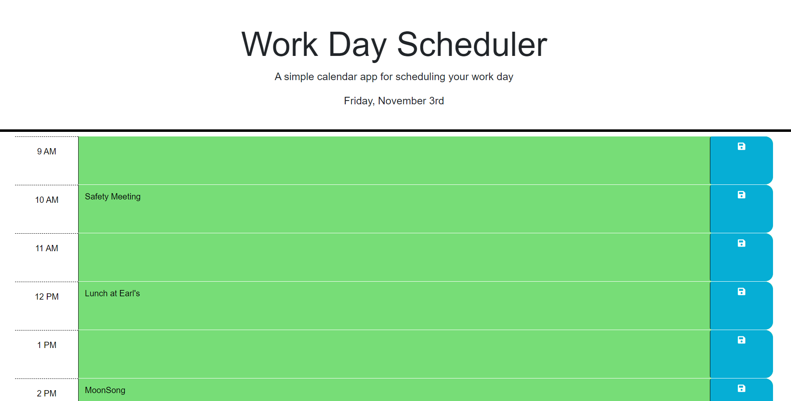

# Work Day Scheduler

## Description

The intent of this project is to have a Daily Scheduler web app to plan one's day.

The user has can see at a glance what is in the past, current, and future hour by the time slot colour coded background.

It should be noted that, after my last challenge, I decided to start the project with all dynamic content to make development simpler in the long run.

What I learned from this project is how to program in classes with Javascript.  This is a skill I've known for a while with Python.
The code is much easier to follow and build upon.

I also learned that element attributes and listeners work easily on elements made dynamically in a for loop.
That's a very convenient feature of Javascript.

I also chose to have the Save Button change colour for the same amount of time that the feedback is in the header.
This let's the user see that their data was updated into local storage without scrolling up.

It will also be seen that I've chosen to express myself through the code with well named functions, etc. in lieu of comments that can easily be deleted.  I think that the srategy has served the purpose.

## Installation

Repository location:        https://github.com/harrymac1972/Work-Day-Scheduler

In Git Bash please type:
    <strong>git clone git@github.com:harrymac1972/Work-Day-Scheduler.git</strong>
once in your folder of choice

## Usage

## Credits

Resources:

    https://www.w3schools.com/jquery/default.asp

    previous Python programming with Classes and Methods for structure.

